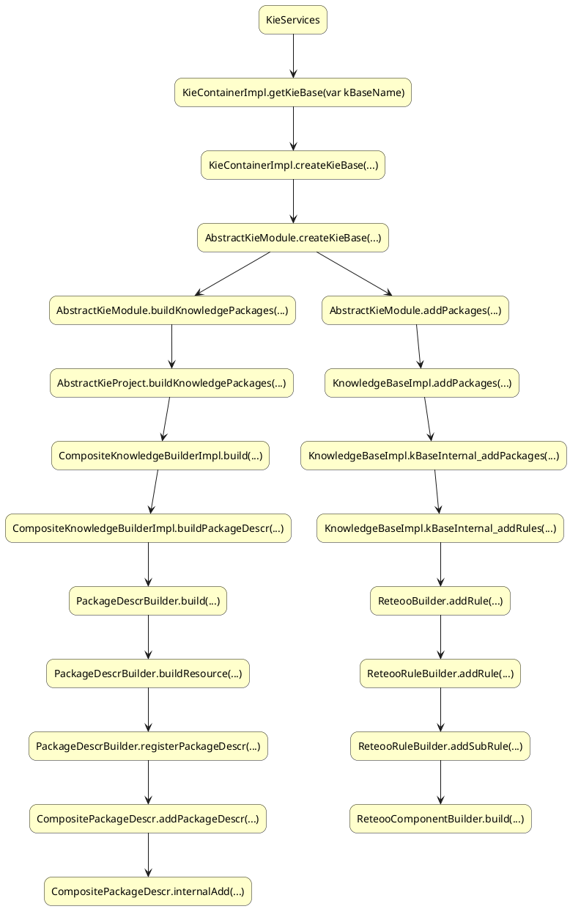

# rule-engine-practice
Predictive models can be used to improve decision making throughout an organization’s daily operations and throughout their customer’s journey. Examples of predictive modeling applications include (but are not limited to):

